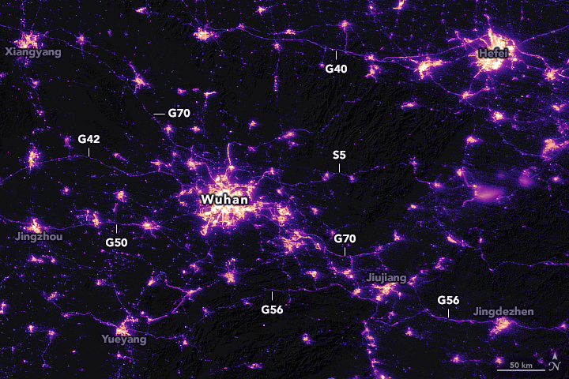

# seersNightLight

SDG 11

Our goal is to anaylze the impact COVID-19 has made on our society by looking at the 
progress of the UN's Sustainable Developement Goals. In particular, our team is focused
on SDG 11: Sustainable Cities and Communities.


## Data and Conclusions
* a list of dates can be found on our [website](https://sfwang.wixsite.com/mysite)
* images of night radience were provided by [NOAA (NCIE) VIIRS DNB Nighttime Imagery](https://ngdc.noaa.gov/eog/viirs/download_dnb_composites.html)
  - images were scraped via the provided REST API powered by ArcGIS

City|Initial Illumination (% area)|Final Illumination (% area)| Delta
---|---|---|---
New York|11.280|10.380|-0.900
Atlanta|8.266|7.895|-0.372
Delhi|11.190|8.141|-3.049
Seoul|12.620|12.350|-0.527
Lombardy|16.040|16.530|+0.490

Standard Deviation of Delta: 1.0063563186069

In general, the amount of illumination in cities bearing the brunt of the
COVID-19 pandemic decreased. Our team believes this is due to the policies
implemented by governments for quarantine. A lockdown induces a decrease in the
number of people who go outside for shopping, vacations, and/or work. 


## syntax and process
```
$ python analyzeNightLight.py [file1] [file2] ...

#example
$ python analyzeNightLight.py hubei_vir_2020019.png hubei_vir_2020035.png
hubei_vir_2020019.png has 8.166% illuminated
hubei_vir_2020035.png has 7.627% illuminated

```



Above is the preprocessed image of Wuhan, China on January 19, 2020. Using
OpenCV, the image is processed to remove noise and isolate the significant
areas of brightness. Then, PIL is used to iterate through each pixel to find
the percentage of luminescence in the image.


